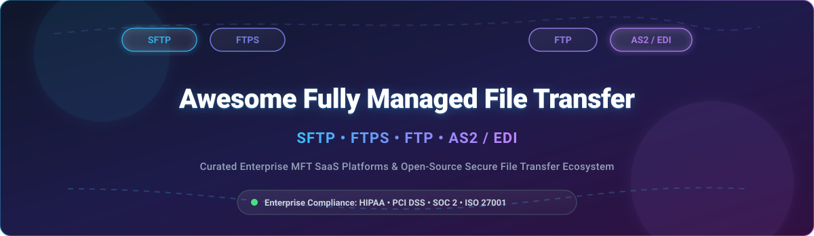

# Awesome-Fully-Managed-File-Transfer-SFTP-FTPs-FTP-AS2 📁 🔄

  

  
  
  
  
  
  

---

## 🌟 Top Fully Managed File Transfer (SFTP/FTPS/FTP/AS2) Ecosystem

**Curated Directory of Commercial MFT SaaS Platforms & Open-Source Secure File Transfer Tools**  
*Comprehensive resource for Enterprise Managed File Transfer (MFT), B2B AS2/EDI Data Exchange, High-Performance SFTP/FTPS/FTP Servers, End-to-End Encryption, Compliance Standards (HIPAA, PCI DSS, SOC 2, GDPR) & Cloud-Native Storage Gateways.*

**Last updated: October 2026** 📅

---

### 📌 Overview & SEO Summary

Welcome to the definitive curated ecosystem guide to **managed file transfer (MFT) platforms**, **open-source SFTP/FTPS/FTP servers**, and **AS2/EDI enterprise communication frameworks**. Whether you are evaluating enterprise-grade cloud MFT solutions (such as *AWS Transfer Family*, *Progress MOVEit*, *GoAnywhere MFT*, and *Axway SecureTransport*), or exploring self-hostable open-source alternatives (like *rclone*, *SFTPGo*, *Paramiko*, *OpenSSH*, *ProFTPD*, and *OpenAS2*), this list covers industry leaders, compliance certifications, protocol support, and transparent valuation and pricing data.

**Key Market Insights:**
- **AWS Transfer Family** delivers **fully managed SFTP, FTPS, FTP, and AS2 endpoints** backed by **AWS S3 or EFS** with **pay-as-you-go pricing** and zero server management overhead.
- **GoAnywhere MFT** starts at **$4,995** for the **Professional edition**, while **Progress MOVEit** and **Axway** serve large enterprise clients via tailored quote-based licensing models.
- **rclone** and **OpenSSH SFTP** lead the open-source landscape with massive developer adoption, serving as foundational tools for automated cloud synchronization and secure remote shell transport.

---

## 📑 Table of Contents

- [🏢 SaaS & Commercial Platforms](#-saas--commercial-platforms)
- [🔓 Open-Source GitHub Projects](#-open-source-github-projects)
- [🛠️ How to Contribute](#%EF%B8%8F-how-to-contribute)
- [📊 Star History](#-star-history)
- [🤝 Support & Sponsorship](#-support--sponsorship)
- [⚠️ Disclaimer](#%EF%B8%8F-disclaimer)

---

## 🏢 SaaS / Commercial Platforms

> [!NOTE]
> **Market Size & Structure**: The Global Managed File Transfer (MFT) market is estimated at **$1.8 Billion - $2.5 Billion** and is **moderately fragmented**. The sector features mega-cap hyperscalers (e.g., AWS Transfer Family) alongside established enterprise cybersecurity suites (Fortra, Progress Software) and agile niche cloud-native SFTP gateways (Files.com, Couchdrop, SFTP To Go).

*Sorted by Valuation / Market Cap / Company Scale (Descending)* 📈

| SaaS / Commercial Platform | Company / Owner | Valuation / Company Scale | Standard Edition Starting Price | Free Tier / Free Trial Limits | Key Features & Description |
| :--- | :--- | :--- | :--- | :--- | :--- |
| **[AWS Transfer Family](https://aws.amazon.com/aws-transfer-family/)** ☁️ | Amazon | **~$2.0 Trillion** | **$0.30/hour per endpoint** + **$0.04/GB** (SFTP/FTPS/FTP); **AS2: $0.30/hour + $0.04/GB** | **250 GB/month for 12 months** | **AWS-native managed file transfer** — **Fully managed SFTP, FTPS, FTP, and AS2 endpoints** . **S3 or EFS backend** — no server management . **Pay-as-you-go pricing** . **Supports PGP encryption, MFA, and VPC endpoints** . ☁️ |
| **[Progress MOVEit](https://www.progress.com/moveit)** 🏢 | Progress Software | **~$1.5 Billion** | **Quote-based (SaaS / On-Prem licensing)** | **30-day free trial** | **Enterprise MFT platform** — **Secure file transfer with compliance (HIPAA, PCI DSS, SOC 2, GDPR)** . **Automation, analytics, and failover** . **On-premises or cloud deployment** . **The most widely deployed enterprise MFT platform** . 🏢 |
| **[Axway SecureTransport](https://www.axway.com/)** 🔵 | Axway | **~$1.5 Billion** | **Quote-based (starts ~$3,500/month managed)** | **Interactive web demo available** | **Enterprise MFT platform** — **Secure file transfer with governance and compliance** . **High-volume B2B/EDI and MFT** . **On-premises or cloud deployment** . 🔵 |
| **[GoAnywhere MFT](https://www.goanywhere.com/)** 🎯 | Fortra (HelpSystems) | **Private (Large PE-backed)** | **$4,995** (Professional edition) | **30-day free trial** | **Managed file transfer platform** — **SFTP, FTPS, FTP, AS2, and HTTPS** . **Workflow automation, encryption, and compliance** . **On-premises or cloud deployment** . **The most feature-complete MFT platform** . 🎯 |
| **[Globalscape EFT](https://www.globalscape.com/)** 🟢 | HelpSystems (Fortra) | **Private (Large PE-backed)** | **Quote-based (modular licensing)** | **15-day free trial** | **Enterprise file transfer** — **Secure MFT with DMZ gateway** . **Automation and compliance** . **The most secure MFT platform** . 🟢 |
| **[Files.com](https://www.files.com/)** 🚀 | Files.com | **Private (Growth Stage)** | **$29/month** (Starter plan) | **7-day free trial** | **Cloud-native file transfer platform** — **SFTP, FTPS, FTP, AS2, and WebDAV** . **API-first with workflow automation** . **The most developer-friendly MFT platform** . 🚀 |
| **[ExaVault](https://www.exavault.com/)** 📂 | ExaVault (Files.com) | **Private (Growth Stage)** | **$35/month** (Starter plan) | **14-day free trial** | **Cloud file transfer platform** — **SFTP, FTPS, FTP, and WebDAV** . **Built-in web UI and API** . **The most accessible cloud FTP platform** . 📂 |
| **[Couchdrop](https://couchdrop.io/)** 🛋️ | Couchdrop | **Private (Venture Backed)** | **$25/month** (Starter plan) | **7-day free trial** | **Cloud SFTP gateway** — **SFTP, FTPS, FTP, and SCP** . **Connects to S3, Azure Blob, Google Drive, and more** . **The most storage-agnostic SFTP gateway** . 🛋️ |
| **[SFTP To Go](https://sftptogo.com/)** 🟡 | SFTP To Go | **Private (Bootstrapped)** | **$19/month** (Basic plan) | **7-day free trial** | **Heroku-native SFTP service** — **SFTP, FTPS, and S3 backend** . **Simple setup with automated key rotation** . **The simplest SFTP platform for Heroku** . 🟡 |
| **[Thorn SFTP Gateway](https://thorntech.com/sftp-gateway/)** 📦 | Thorn Technologies | **Private (Niche SMB)** | **$0.08/hour** (Standard BYOL/Marketplace) | **30-day free trial (AWS/Azure Marketplaces)** | **SFTP gateway for cloud storage** — **SFTP, FTPS, and FTP access to S3, Azure, and GCP** . **The most cloud-native SFTP gateway** . 📦 |

---

## 🔓 Open-Source GitHub Projects

*Sorted by GitHub Stars Count (Descending)* 🌟

- **[rclone](https://github.com/rclone/rclone)**   
  **The Swiss army knife of cloud storage sync**, MIT licensed. **50K+ GitHub stars** — **supports SFTP, FTP, WebDAV, and 70+ cloud storage providers** . **The most versatile open-source file transfer tool** . 🔄 ⚡

- **[Paramiko](https://github.com/paramiko/paramiko)**   
  **The leading native Python SSHv2 protocol library**, LGPL-2.1 licensed. **The standard for Python SFTP client & server development** . **Used by Ansible, Fabric, and thousands of automation frameworks** . **The definitive Python SFTP library** . 🐍 🔐

- **[SFTPGo](https://github.com/drakkan/sftpgo)**   
  **Full-featured and highly configurable event-driven storage server**, AGPL-3.0 licensed. **Supports SFTP, HTTP/S, FTP/S, WebDAV, with S3, Azure Blob, and GCP backends** . **Includes PGP encryption, WebUI admin, and virtual users** . 📦 🚀

- **[Cyberduck](https://github.com/iterate-ch/cyberduck)**   
  **Libre server and cloud storage browser**, GPL-3.0 licensed. **The most popular open-source SFTP/FTP GUI client** . **Supports SFTP, FTP, WebDAV, S3, Azure, and Google Drive** . **The standard for cross-platform desktop file transfer** . 🦆 💻

- **[OpenSSH](https://github.com/openssh/openssh-portable)**   
  **The most widely deployed SSH and SFTP server**, BSD-2-Clause licensed. **Included with every Linux distribution** — **the ubiquitous foundation of secure file transfer** . **SFTP server with chroot jails, key-based authentication, and SCP** . **The definitive open-source SFTP implementation** . 🔐 🛡️

- **[ssh2](https://github.com/mscdex/ssh2)**   
  **Pure JavaScript SSH2 client and server modules for Node.js**, MIT licensed. **The default library for Node.js SFTP workflows** . **High performance streams and key parsing** . 🟢 ⚡

- **[WinSCP](https://github.com/winscp/winscp)**   
  **Windows SFTP and FTP client**, GPL-3.0 licensed. **The most popular Windows SFTP client** . **GUI and scripting interface** . **Supports SFTP, SCP, FTP, and WebDAV** . 🪟 📄

- **[PycURL](https://github.com/pycurl/pycurl)**   
  **Python interface to libcurl**, LGPL-2.1 licensed. **The standard for high-performance Python file transfer** . **Supports SFTP, FTPS, FTP, HTTP, and HTTPS** . **The foundation for Python file transfer automation** . 🐍 📡

- **[ProFTPD](https://github.com/proftpd/proftpd)**   
  **Highly configurable FTP server**, GPL-2.0 licensed. **The most widely deployed open-source FTP server** . **Supports FTPS (SSL/TLS), virtual hosts, and custom modules** . **The standard for Unix/Linux FTP/FTPS servers** . 📡 🛡️

- **[AsyncSSH](https://github.com/ronf/asyncssh)**   
  **Asynchronous SSHv2 client and server for Python asyncio**, EPL-2.0 licensed. **Modern async implementation of SFTP client and server protocols** . **High throughput concurrent file transfer** . 🐍 ⚡

- **[lftp](https://github.com/lavv17/lftp)**   
  **Sophisticated command-line file transfer program**, GPL-3.0 licensed. **Supports FTP, FTPS, HTTP, HTTPS, SFTP, and BitTorrent** . **The most feature-complete command-line file transfer utility** . 💻 🔄

- **[OpenAS2](https://github.com/OpenAS2/OpenAs2App)**   
  **Java-based AS2 server for EDI over the Internet**, BSD-2-Clause licensed. **The most widely deployed open-source AS2 server** . **Supports AS2, AS3, and MDN receipts** . **Used for enterprise B2B/EDI electronic document interchange** . 📨 🏢

- **[vsftpd](https://github.com/silverwind/vsftpd)**   
  **Very Secure FTP Daemon**, GPL-2.0 licensed. **The most secure open-source FTP server** . **Lightweight, extremely fast, and battle-tested** . **The default FTP server on RHEL, CentOS, and Fedora** . 🛡️ 🔒

- **[FileZilla Server](https://github.com/filezilla/filezilla-server)**   
  **Open-source FTP and FTPS server**, GPL-2.0 licensed. **The most popular open-source FTP server for Windows & Linux** . **GUI administration, user isolation, and SSL/TLS** . **The standard desktop FTP/FTPS server** . 📁 🖥️

---

## 🛠️ How to Contribute

Contributions are welcome! Follow these steps to submit new managed file transfer platforms or open-source file transfer software:

1. 🍴 **Fork** the repository.
2. 📝 **Add/edit** entries in `README.md` maintaining table/list structure and formatting.
3. 🔗 Include project title, official website/GitHub link, exact Stars_Count badge, license, and brief description.
4. 🚀 Submit a **Pull Request** with a descriptive summary of your changes.

---

## 📊 Star History

---

## 🤝 Support & Sponsorship

If you find this managed file transfer ecosystem directory useful, please consider supporting the project:

- ⭐ **Star** this repository on GitHub to increase visibility!
- 🔀 **Fork** and share with fellow integration engineers, system administrators, and open-source advocates.
- ☕ **Sponsor & Buy Me a Coffee**: Support ongoing maintenance and curation via the [GitHub Sponsor Dashboard](https://github.com/sponsors/ishandutta2007).

---

## ⚠️ Disclaimer

- This is a **community-curated** directory — not exhaustive and not an official commercial endorsement. ℹ️
- **AWS Transfer Family charges $0.30/hour per endpoint** plus **$0.04/GB** for SFTP/FTPS/FTP, and **AS2 endpoints at $0.30/hour + $0.04/GB**. **GoAnywhere MFT Professional starts at $4,995**. **SFTP To Go starts at $19/month**.
- **OpenSSH SFTP is the most widely deployed open-source SFTP server** — included with **every Linux distribution** at zero cost. **ProFTPD and vsftpd** are standard open-source FTP/FTPS servers.
- **Open-source file transfer tools require deployment, certificate management, and ongoing security patching**. Always validate encryption, authentication, and compliance controls with a proof-of-concept before production deployment. 📁

---

  <b>Made with ❤️ for integration engineers, IT administrators, and open-source file transfer advocates.</b>

